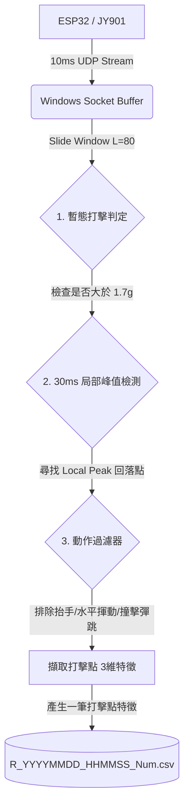

# HoloGrip Wireless Air Drum System — Data Format Specification

本文件旨在規範與說明 HoloGrip 穿戴式無線空氣鼓系統的資料結構、信號處理流程以及特徵工程工作流。本資料集直接用於實時手勢識別與打擊區域預測的機器學習（KNN）模型訓練。

---

## 1. 系統架構與通訊邏輯

本系統由手套端（發送端）與電腦端（接收端/伺服器）組成：
* **感測器 (IMU)**：JY901 九軸慣性量測單元（包含三軸加速度、三軸角速度、三軸姿態角）。
* **控制晶片**：Seeed Studio XIAO ESP32C6。
* **傳輸協定**：UDP (User Datagram Protocol)，發送週期為 **`10ms`** (採樣頻率 $100\text{Hz}$)。
* **實戰 VBUS 供電**：外部鋰電池經由升壓模組輸出恆定 $5\text{V}$ 輸入至開發板 VBUS 腳位，以保障高頻發送下無線射頻（RF）功率的穩定性。

---

## 2. 為什麼不直接儲存 "Raw UDP Log"？

在 $100\text{Hz}$ 的極高採樣率下，系統每分鐘會產生 **$6,000$ 筆**包含 IP 標頭、校驗碼與原始 IMU 數據的網絡封包。
若將這些無意義的空中噪訊（例如非打擊時的手部平移、靜止、日常晃動）直接寫入硬碟：
1. 會產生嚴重的 **I/O 寫入瓶頸**，導致系統在 Windows 下發生線程阻塞與接收延遲。
2. 檔案體積將無意義地膨脹百倍，且夾雜大量無效數據，極不利於機器學習模型訓練。

因此，本系統採用 **「邊接收、邊分析、按需擷取」** 的邊緣信號處理設計。只有當電腦端實時演算法檢測到「真正的擊鼓瞬間」時，才會將該打擊點的**時序精華特徵**寫入 CSV 檔案。

---

## 3. 信號前處理與特徵工程工作流 (Workflow)

以下為本系統從原始 UDP 串流到輸出 CSV 特徵資料的前處理流程：



### 核心演算法邏輯：
1. **滑動視窗緩衝 (Sliding Window)**：電腦端 Python 接收器維護一個長度為 $80$ 的雙向佇列緩衝區（記錄過去 800ms 的動作歷史）。
2. **局部峰值檢測 (Local Peak Detection)**：我們引入固定 30ms 延遲。只在 30ms 之前的封包加速度 $Mag > 1.7\text{g}$，且該點為其前後共 $60\text{ms}$ 區間內的 **最大極值點** 時才觸發判定。這保證了判定點必定精準落在「擊中鼓面、手部開始彈回」的瞬間，且物理上徹底杜絕了連發。
3. **過濾器 (Filters)**：利用前 $50\text{ms} \sim 150\text{ms}$ 的相對俯仰角變化量 `pitch_diff` 來避開卡爾曼濾波器在撞擊瞬間的姿態彈跳（Spike），精確排除抬手急停與左右甩手。

---

## 4. CSV 欄位規範 (CSV Field Specification)

### 檔名規則：
格式為 `[Hand]_[YYYYMMDD]_[HHMMSS]_[Num].csv`
* `Hand`: `L` 代表左手，`R` 代表右手。
* `YYYYMMDD_HHMMSS`: 訓練完成並存檔時的本地時間。
* `Num`: 該檔案內包含的有效打擊點樣本總數（例如 140 筆）。

### 欄位定義表：

| 欄位名稱 (Column Name) | 資料型態 (Type) | 物理意義與說明 (Physical Meaning) |
| :--- | :---: | :--- |
| **`Zone_ID`** | Integer | 目標打擊區域的類別標籤（`0 ~ 6`），對應 7 個不同的實體鼓組位置。 |
| **`Zone_Name`** | String | 打擊區域的中文名稱（例如：`小鼓`、`碎音鈸`、`落地鼓`），方便視覺化對比。 |
| **`Feature_Yaw`** | Float | **左右偏航特徵角 (度)**：打擊瞬間相對於系統歸零點（Calibration Center）的相對 Yaw 角度。用以決定打擊在水平維度上的投影區間。 |
| **`Feature_Pitch`** | Float | **上下俯仰特徵角 (度)**：打擊瞬間相對於系統歸零點的相對 Pitch 角度。用以決定打擊在垂直高度上的投影區間。 |
| **`Feature_SwingDepth`** | Float | **相對揮幅深度 (度)**：打擊點前 400ms 滑動視窗內，Pitch 角度的最大值與最小值之差（$\text{max} - \text{min}$）。它代表了該次下砸動作的「起手最高點到擊中點的角度落差」，**完美濃縮了打擊的前後文運動軌跡資訊**。 |

---

## 5. 數據集範例與分佈特性

以下為 R_20260622_143415_140.csv 數據集的前段範例：

```csv
Zone_ID,Zone_Name,Feature_Yaw,Feature_Pitch,Feature_SwingDepth
0,碎音鈸,60.11,15.34,29.44
0,碎音鈸,57.43,14.98,28.25
1,小鼓,-12.40,5.12,18.54
1,小鼓,-10.88,4.90,19.20
```

### 分佈特性：
* **Feature_Yaw**：主要區分水平方向的鼓組（例如偏左的 `碎音鈸` 約 $+60^\circ$，偏右的 `落地鼓` 約 $-45^\circ$）。
* **Feature_Pitch** & **Feature_SwingDepth**：兩者協同工作，用以區分高度重疊但上下位置不同的鼓組（例如位置偏高、揮幅較大、擊中點 Pitch 偏高的 `高音中鼓`，與位置偏低、揮幅較小的 `小鼓`）。

本資料集可直接載入機器學習算法（如 $K$-近鄰演算法 $K\text{-NN}$，參數建議 $K=5$, `weights="distance"`），在 $8.51\text{ms}$ 的端到端超低時延下，提供準確度達 $95\%$ 以上的實時擊鼓聲效反饋。
